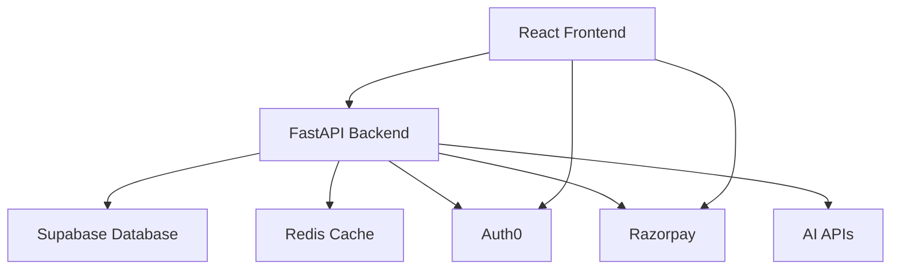

# Xcore-ai SAAS Platform

A comprehensive full-stack SAAS application featuring AI-powered chat functionality, user authentication, and payment processing.

## 🚀 Features

- **AI-Powered Chat Interface**: Interactive chat with multiple AI model support
- **Authentication & Authorization**: Secure user management with Auth0
- **Payment Processing**: Subscription management with Razorpay integration
- **Real-time Chat History**: Persistent chat storage and retrieval
- **User Profile Management**: Comprehensive user dashboard
- **Rate Limiting**: Hybrid rate limiting system for API protection
- **Caching**: Redis-powered caching for improved performance
- **Theme Support**: Light/dark mode with custom themes
- **Mobile Responsive**: Optimized for all device sizes

## 🛠 Tech Stack

### Frontend
- **React 18** with TypeScript
- **Vite** for fast development and building
- **Tailwind CSS** for styling
- **Auth0** for authentication
- **React Router** for navigation
- **Lucide React** for icons

### Backend
- **Python 3.11+** with FastAPI
- **Supabase** for database and authentication
- **Redis** for caching and rate limiting
- **Auth0** for JWT token validation
- **Razorpay** for payment processing
- **Pydantic** for data validation

### Infrastructure
- **Docker** containerization
- **Vercel** for frontend deployment
- **Supabase** for database hosting
- **Redis Cloud** for caching

## 📁 Project Structure

```
SAAS/
├── backend/                 # Python FastAPI backend
│   ├── auth/               # Authentication handlers
│   ├── middleware/         # Custom middleware
│   ├── models/             # Data models
│   ├── services/           # Business logic services
│   ├── utils/              # Utility functions
│   ├── web/                # Web handlers
│   ├── main.py             # Application entry point
│   ├── requirements.txt    # Python dependencies
│   └── .env               # Environment variables
│
├── frontend/               # React TypeScript frontend
│   ├── app/               # Main application code
│   │   ├── components/    # Reusable components
│   │   ├── hooks/         # Custom React hooks
│   │   ├── lib/           # Utility libraries
│   │   ├── providers/     # Context providers
│   │   ├── routes/        # Page components
│   │   ├── services/      # API services
│   │   └── types/         # TypeScript types
│   ├── public/            # Static assets
│   ├── build/             # Production build
│   ├── package.json       # Node dependencies
│   └── vite.config.ts     # Vite configuration
│
└── README.md              # This file
```

## 🔧 Setup Instructions

### Prerequisites
- Python 3.11+
- Node.js 18+
- Redis instance
- Supabase account
- Auth0 account
- Razorpay account

### Backend Setup

1. **Navigate to backend directory:**
   ```bash
   cd backend
   ```

2. **Create virtual environment:**
   ```bash
   python -m venv venv
   ```

3. **Activate virtual environment:**
   ```bash
   # Windows
   venv\Scripts\activate
   
   # macOS/Linux
   source venv/bin/activate
   ```

4. **Install dependencies:**
   ```bash
   pip install -r requirements.txt
   ```

5. **Configure environment variables:**
   
   Copy `.env` file and update with your credentials:
   ```env
   # Supabase Configuration
   SUPABASE_URL=your_supabase_url
   SUPABASE_ANON_KEY=your_supabase_anon_key
   SUPABASE_SERVICE_KEY=your_supabase_service_key
   
   # Auth0 Configuration
   AUTH0_DOMAIN=your_auth0_domain
   AUTH0_API_AUDIENCE=your_api_audience
   AUTH0_CLIENT_ID=your_client_id
   AUTH0_CLIENT_SECRET=your_client_secret
   
   # AI API Keys
   DEEPSEEK_API_KEY=your_deepseek_key
   OPENROUTER_API_KEY=your_openrouter_key
   
   # Payment Configuration
   RAZORPAY_KEY_ID=your_razorpay_key_id
   RAZORPAY_KEY_SECRET=your_razorpay_secret
   
   # Redis Configuration
   REDIS_URL=your_redis_url
   
   # Application Configuration
   FRONTEND_URL=your_frontend_url
   API_BASE_URL=your_api_url
   SERVICE_TOKEN=your_service_token
   ```

6. **Start the backend server:**
   ```bash
   uvicorn main:app --reload --host 0.0.0.0 --port 8000
   ```

### Frontend Setup

1. **Navigate to frontend directory:**
   ```bash
   cd frontend/react-fast
   ```

2. **Install dependencies:**
   ```bash
   npm install
   ```

3. **Configure environment variables:**
   
   Create `.env.local` file:
   ```env
   VITE_AUTH0_DOMAIN=your_auth0_domain
   VITE_AUTH0_CLIENT_ID=your_client_id
   VITE_AUTH0_AUDIENCE=your_api_audience
   VITE_API_BASE_URL=http://localhost:8000
   ```

4. **Start the development server:**
   ```bash
   npm run dev
   ```

## 🚦 Running the Application

### Development Mode

1. **Start Redis server** (if running locally)
2. **Start backend server** on port 8000
3. **Start frontend development server** on port 5173
4. **Access the application** at `http://localhost:5173`

### Production Build

1. **Build frontend:**
   ```bash
   cd frontend/react-fast
   npm run build
   ```

2. **Deploy backend** to your preferred hosting service
3. **Deploy frontend** to Vercel, Netlify, or similar

## 🔐 Authentication Flow

1. **User Registration/Login** via Auth0
2. **JWT Token** verification for API access
3. **Role-based access control** for different features
4. **Session management** with automatic token refresh

## 💳 Payment Integration

- **Razorpay** for subscription management
- **Multiple plans**: Basic, Premium, Enterprise
- **Secure payment processing** with webhook validation
- **Subscription status tracking**

## 🗄 Database Schema

### Core Tables
- **users**: User profile information
- **chat_sessions**: Chat conversation history
- **payments**: Payment transaction records
- **user_subscriptions**: Subscription status and plans

## 🔄 API Endpoints

### Authentication
- `POST /auth/register` - User registration
- `POST /auth/login` - User login
- `POST /auth/refresh` - Token refresh

### Chat
- `POST /chat/send` - Send message
- `GET /chat/history` - Get chat history
- `DELETE /chat/clear` - Clear chat history

### Payment
- `POST /payment/create` - Create payment
- `POST /payment/webhook` - Handle payment webhooks
- `GET /payment/status` - Get payment status

## 🧪 Testing

### Backend Tests
```bash
cd backend
pytest
```

### Frontend Tests
```bash
cd frontend/react-fast
npm test
```

## 📊 Monitoring & Logging

- **Structured logging** with Python logging
- **Error tracking** and monitoring
- **Performance metrics** tracking
- **Redis monitoring** for cache performance

## 🔧 Development Tools

- **TypeScript** for type safety
- **ESLint** for code linting
- **Prettier** for code formatting
- **Docker** for containerization
- **Hot reload** for development

## 🤝 Contributing

1. Fork the repository
2. Create a feature branch
3. Commit your changes
4. Push to the branch
5. Create a Pull Request

## 📄 License

This project is licensed under the MIT License.

## 🆘 Support

For support, please contact koustubhayadiyala36@gmail.com or create an issue in the repository.

## 🏗 Architecture



## 📈 Performance Optimizations

- **Redis caching** for frequently accessed data
- **Database indexing** for fast queries
- **Code splitting** in React for smaller bundles
- **Lazy loading** for better initial load times
- **Image optimization** and compression

## 🔒 Security Features

- **JWT authentication** with secure token handling
- **CORS configuration** for API security
- **Input validation** using Pydantic
- **SQL injection prevention** with parameterized queries
- **Rate limiting** to prevent abuse
- **Environment variable protection** for sensitive data

---

Built with ❤️ by the Xcore-ai Team